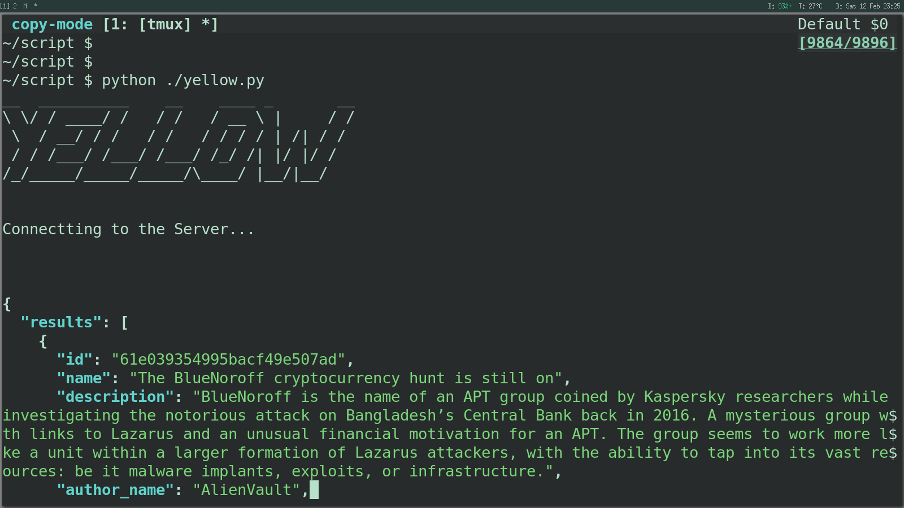

YELLOW
===

**Cyber-Yellow** is a *Command Line Utility to Tracking Hackers Groups by IP/Domain.*



<br>

## Installation

### Install [pyfiglet](https://github.com/pwaller/pyfiglet)
```python
pip install pip install pyfiglet
```
<br>

### Install [jq (JSON Query)](https://stedolan.github.io/jq/)

#### for Debian/Ubuntu/Kali

```bash
apt install -y jq
```

#### for RHEL/CentOS/Fedora
```bash
dnf install -y jq
```

#### for WSL/WSL2
```bash
apt install -y jq
```

#### for Windows
**[Download](https://github.com/stedolan/jq/releases/download/jq-1.6/jq-win64.exe)**

<br>

## How to Run
```shell
$ python ./yellow.py
```
